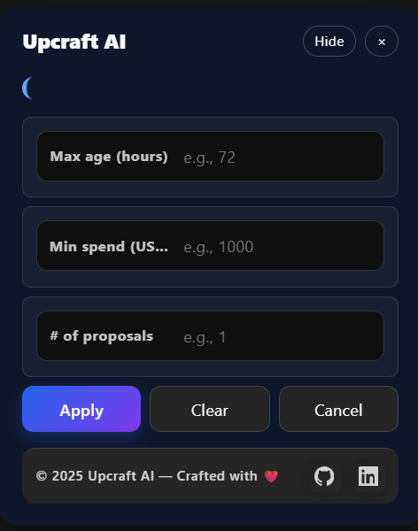
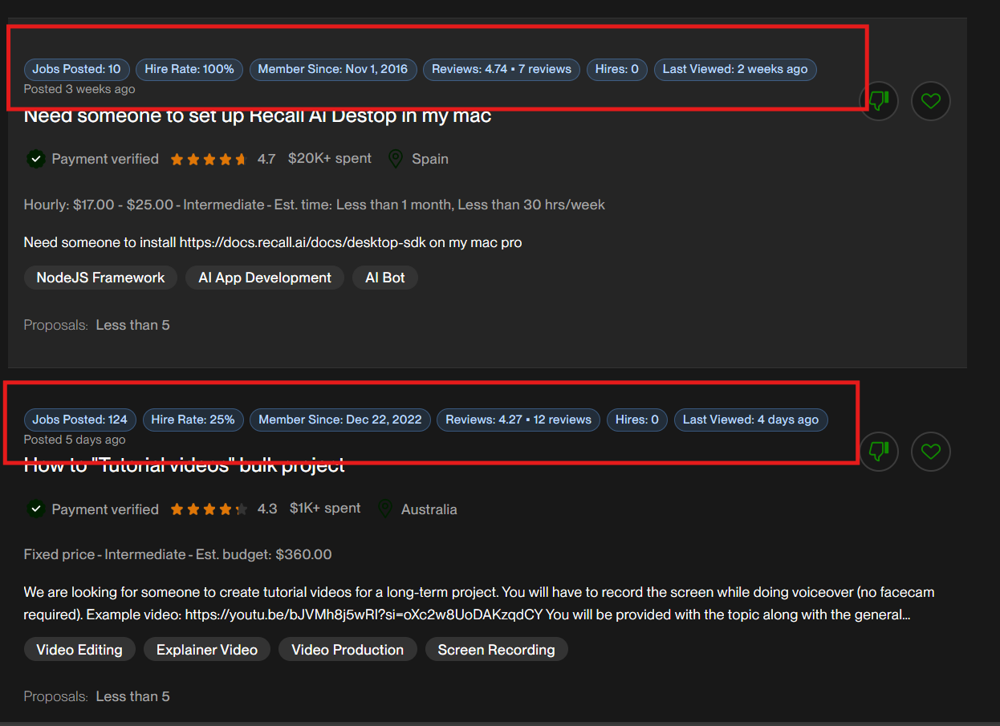
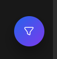

## Upcraft AI – Smart filters and insights for Upwork

Upcraft AI is a lightweight Chrome (MV3) extension that upgrades your Upwork job search with a draggable in‑page panel, modern UI, and automatic job enrichment. It works entirely on the client side and only on `upwork.com`.

### Highlights
- **In‑page panel**: Opens from the extension icon, no separate popup.
- **Draggable + remembers position**: Panel and floating icon persist their last location.
- **Modern UI**: Dark/light aware, glassy surfaces, inline input labels.
- **Quick filters**:
  - Job Posted (minutes)
  - Min spend (USD)
  - No. of proposals 
- **Job enrichment** (per job): Reviews, Client type (Individual/Company), Member since, Jobs posted, Hire rate, Last viewed, Hires.


---

## Downloads

### Latest Release
> **Note**: This section will be automatically updated when using GitHub Actions workflow.

[](https://github.com/akifejaz/docs-upcraft/releases/latest)

**Quick Download Links:**
- [📦 Download Latest Release](https://github.com/akifejaz/docs-upcraft/releases/download/v1.1.0/upcraft-extension-v1.1.0.zip)
- [📋 View All Releases](https://github.com/akifejaz/docs-upcraft/releases)
- [📖 Release Notes](https://github.com/akifejaz/docs-upcraft/releases/latest)

### Alternative Download Methods

1. **From Releases Page**: Visit our [releases page](https://github.com/akifejaz/docs-upcraft/releases) to download any version


## Screenshots





---

## Installation (local / development)

1. Clone the repository.
2. Open Chromium‑based browser (Chrome or Edge) and go to `chrome://extensions/`.
3. Enable “Developer mode”.
4. Click “Load unpacked” and select the project folder.
5. Pin the extension and click the Upcraft AI icon while on an Upwork job search page.

The extension is Manifest V3 and requests minimal permissions:

```json
{
  "manifest_version": 3,
  "permissions": ["activeTab", "storage", "scripting"],
  "host_permissions": ["https://*.upwork.com/*"]
}
```

---

## Usage

### Opening the panel
- Navigate to an Upwork job search page and click the Upcraft AI toolbar icon.
- The panel opens in the page at its last saved position. Use the “Hide” button to collapse into a floating circular icon; click the icon to restore.

### Filters
- **Max age (hours)**: Enter hours (e.g., 72). The extension converts hours to days internally for matching.
- **Min spend (USD)**: Minimum client spend shown on the card.
- **# of proposals**: Uses Upwork’s native proposals query parameter. When set, the URL is updated and the page may reload to apply the filter.

### Enrichment
Automatically augments visible cards with:
- Reviews
- Client (Individual or Company)
- Member since
- Jobs posted
- Hire rate
- Last viewed (defaults to “Not Visible”)
- Hires (defaults to 0)

---

## Project structure

```
upcraft/
├─ background.js        # Handles icon click → open panel injection, dynamic icon
├─ content.js           # Injected UI, filters, DOM parsing for enrichment
├─ content.css          # Modern, theme‑aware styles (panel, chips, buttons, footer)
├─ manifest.json        # Chrome MV3 descriptor
├─ icons/               # Toolbar icons (fallbacks; action icon drawn dynamically at runtime)
└─ docs/screenshoots/   # Drop README images here (you create this folder)
```

---

## Development

There is no build step. Edit files and reload the extension in `chrome://extensions/`.

Recommended workflow:
- Keep the DevTools console open to view logs from `content.js` and `background.js`.
- After editing, click “Reload” on the extension card and refresh the Upwork page.

### Linting
The codebase aims to avoid linter errors; keep function and variable names descriptive, prefer early returns, and avoid deep nesting.

---

## Privacy and scope

- Runs only on `upwork.com` (`host_permissions` scoped accordingly).
- No external servers; all parsing happens locally via DOM.
- No tracking or analytics.

---

## Troubleshooting

- Panel doesn’t open when clicking the icon:
  - Ensure you are on an `upwork.com` job search page.
  - Check the Extensions page that the extension is enabled; click “Reload”.
- Floating icon appears but panel doesn’t restore:
  - Click the icon once (don’t drag) to restore. If it “jumps”, it’s handled by normalized drag start logic.
- Enrichment fields missing for some jobs:
  - Upwork markup varies. Defaults are shown when data isn’t present on the job page. If a specific selector variant appears, open an issue with the snippet and we’ll add it.

---

## Credits

Developed by **Akif Ejaz**

- GitHub: `https://github.com/akifejaz`
- LinkedIn: `https://www.linkedin.com/in/akifejaz/`

Design and implementation improvements by the Upcraft AI project.

---

## License

Licensed under the **MIT License**. See `LICENSE` for full text.

